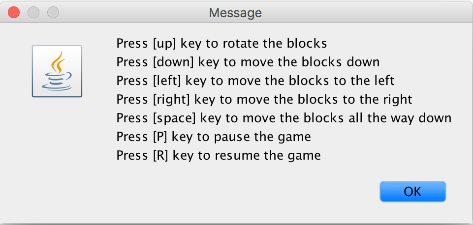
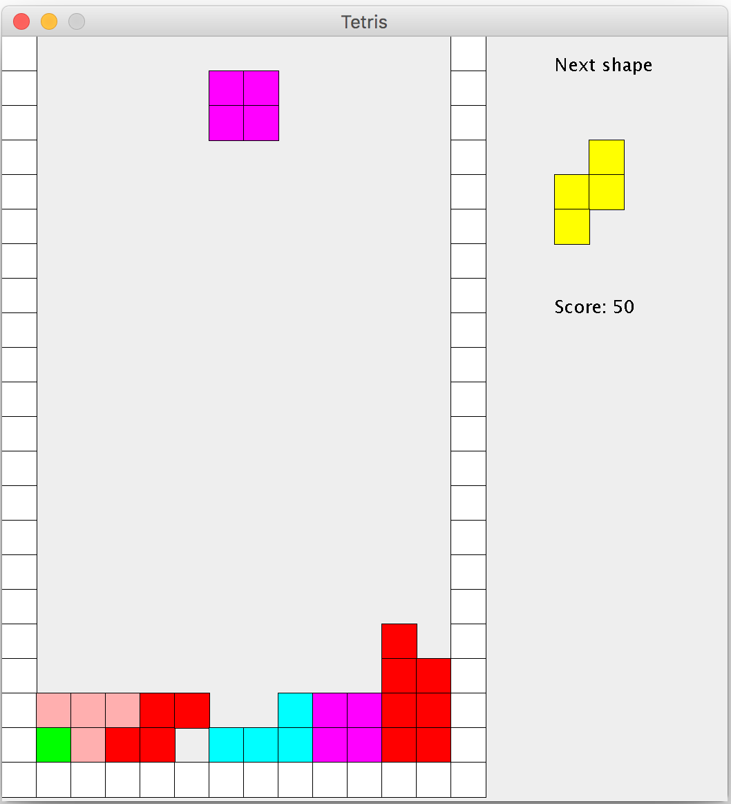

# Tetris
A tribute to the classic video game implemented with Java Swing Library.

## Run the game
1. Run "run.sh" in terminal   
2. Double click on the newly-created tetris.jar file 

## Controls
- [up] key to rotate the block
- [down] key to accelerate the block downward
- [left] key to move the block to the left
- [right] key to move the block to the right
- [space] key to move the block to the botton instantaneously
- [p] key to pause the game
- [r] key to resume the game

## Screenshots

